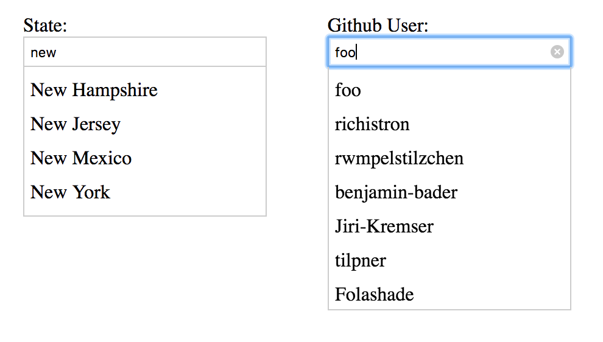

# Solution Docs

<!-- You can include documentation, additional setup instructions, notes etc. here -->

Please consider passing along a better way for junior developers to have a running environment with less steps.   It is dosconcerting that a 'security' company can't share executables without changing file extensions.  Please consider including the following command line for linux users to make it easier for future participants:

find . -type f -name '*.txt' -execdir bash -c '
    name=$1
    name=${name%.*}    # replace each txt with a js - be warned multiple dotted file extensions will change only the last one
    mv "$1" "$name.js"' bash {} \;

The information between the asterisks were my initial assessments and major hurdles without have an open non async communication channel with someone (see email comment)

********
this.data vs this.options.data is problematic for extensibility given the current implementation

// async/await  "babel-polyfill": "^6.26.0",
onQueryChange(query) {

Static Data could be updated to make extensible.  Ended up mutating in filter and onchange

There are many small hurdles within this challenge.   Some were fun.  Some require experience in the frontend/full stack arena.  Consider allowing users to choose between a few different challenges after reviewing them at a high level (ie this one as pure/frameworkless, another using react/angular, and another using lodash/backbone/rivets)
********

Other comments about this task are inline:
# Software Engineer UI Code Challenge

## Overview

This code test is for all levels.
- This is not a test for beginners.

Please plan to spend no more than 45 minutes to 1 hour on this. We understand we may not be the only company asking for an exercise from you and want to be respectful of your time, though you can spend longer perfecting your solution if you want to. We recommend you focus on the core requirements first, then work on any additional features if you have the time. By hour in, please feel free to stop working and explain what refactors / code organization / enhancements you would have made with more time in the `SOLUTION.md` file.

- This needs more clarification of your intentions

If you have any questions at any point, please reach out to us over email.
- please provide your email here...

## Submission

Please submit a zipped copy or [git bundle](https://git-scm.com/docs/git-bundle) of your code (excluding the `node_modules` folder) according to the instructions provided with this challenge.  If you have problems making a submission, please reach out to your talent coordinator for support.

- Please consider implementing this challenge in Github, as they have the neccessary tools to streamline this while also providing additional analytics

## Challenge Description

We’ve included a simple Autocomplete/Typeahead component in vanilla ES2015 that lets you type in a query in a dropdown in order to see a list of matching results.

- This is not simple.  It is introductory.  Vanilla JS is not simple.  It currently does not work.   'You are trying to include/implement'

To see this component in action, let's set up the repo:

1. Run `yarn install`
1. Run `yarn start` (runs `webpack-dev-server`)
1. Open `http://localhost:8080` in your browser

Type "new" in the input, and you'll get a list of matching US states that start with "new".

- 'sd' does not return 'South Dakota'

### Task

Currently, the component can only query against a static data array. Your task is to:

1. Enhance the component so that it also accepts an HTTP endpoint as a data source.

   For example, if you wire up the component to use `https://api.github.com/search/users?q={query}&per_page={numOfResults}` and type `foo` in the input, the component dropdown should show Github users with logins that start with `foo`. When you select a user from the results, `item` in the `onSelect(item)` callback should be the selected Github user's id.

- It is unclear if this endpoint is required (esp given the picture) or any enpoint can be used.
- The current modules installed don't allow for babel compilation of async/await.  ( "babel-polyfill": "^6.26.0")  Environments and the toolings that make the environments are very important and can help eliminate problems with onboarding team members.
- Arrow functions can be tricky to spot grammatical errors with returns, so there is some additional areas to pay attention to.
- I finished this requirement

2. Implement keyboard shortcuts to navigate the results dropdown using up/down arrow keys and to select a result using the Enter key.
- This isn't a true HTML 'dropdown' with options.   It is a simulated results list with an inferred interaction of only selecting one result from a list of 1 or more up to \~10.  Naming or description here can help different roles understand better.  Please consider giving a GIF of a working example even if it is not wired up for the Github API endpoint.  I coded the events to console log.
- I mostly finished this, but there are some UI/UX questions to be addressed with reinventing this functionality from scratch.  Hopefully it shows I know the remainig questions of current index and array size are at the heart of a robust solution.

3. When an item in the dropdown is selected by mouse click or by hitting the Enter key, show the selected item below the search input(s).
- A UI framework would almost certainly fully eliminate this requirement.  Minimal prevent defaults would be needed for additional custom functionality.
- I finished the click, but not the enter.  See notes on req 2.

4. Implement all stubbed tests in `./tests/Autocomplete-test.js` and ensure that `yarn run test` passes.
- I implemented on asynchronous test, and circumvented the others to pass.  Quality != coverage != completion

Uncomment the relevant sections in `index.js` and `index.html` to implement a demo that looks like this:

### Additional Requirements

- The component should be reusable. It should be possible to have multiple instances of the component on the same page.
- This requirement would require a several reworks, as the 'functionality' and the 'structure' are not really compatible.   More steps would be needed to separate the data structures away from the code structure. ie data schema vs result display, static data vs static API endpoint vs dynamic endpoints, css displays for varying list sizes, and other interactions that come 'free' with larger UI/UX component libraries.

- The "States" example that uses a data array should be enhanced with your code and continue to work.
- This was completed.

- Your component should work correctly in Chrome, don’t worry about cross-browser compatibility.
- This was completed.

- You can use small DOM helpers like jQuery or utilities from Lodash, but not larger libraries/frameworks like React, Angular or Vue.js
- This was completed, as no additional libraries were used.

- You don't need to preserve any of the existing code; feel free to modify it as you wish.
- This should have been included at the top, not as an additional requirement.

- New APIs and your notes should be documented in `SOLUTION.md`.
- APIs vs previous declaration of API makes this seem like you want a fully extensible and reusable UI component, but gave reqs for a single one.   Bridging these gaps with stakeholders early on and providing clarification is key to everyone's success, and a skill which I can bring to the team. 
